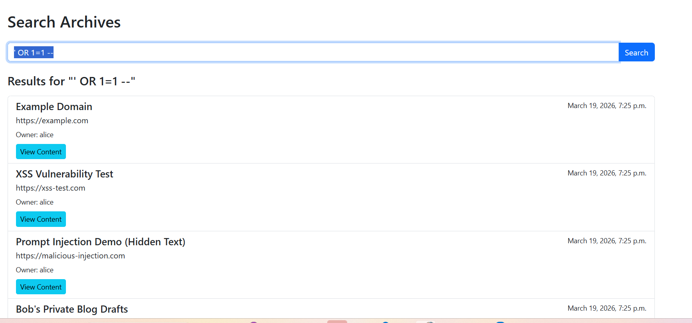

## XSS Vulnerability
In view_archieve.html I have found problematic code as follows

{{ archive.notes|safe }}

{{ archive.content|safe }}

Which creates vulnerability problem

I have used  this code in the add archieves text box and it was working

## FIX
I am going to remove the safe tag from the notes to solve this problem

## SQL Injection
search_archives() in archiver/views.py
This view builds a SQL string by concatenating user-controlled input (query) directly into the SQL:

 sql = f"SELECT archiver_archive.*, auth_user.username FROM archiver_archive JOIN auth_user ON archiver_archive.user_id = auth_user.id WHERE archiver_archive.user_id = {request.user.id} AND title LIKE '%{query}%'"

 I have put ' OR 1=1 -- as input and the output as follows 
 

## FIX

sql = """
        SELECT archiver_archive.*, auth_user.username
        FROM archiver_archive
        JOIN auth_user ON archiver_archive.user_id = auth_user.id
        WHERE archiver_archive.user_id = %s
        AND title LIKE %s
        """

        params = [request.user.id, f"%{query}%"]

## Broken Access Control Found
Object-level access not enforced on archive records
These views fetch Archive objects by pk alone, without checking that the object belongs to the logged-in user:

view_archive()
edit_archive()
delete_archive()
enrich_archive()

archive = get_object_or_404(Archive, pk=archive_id)